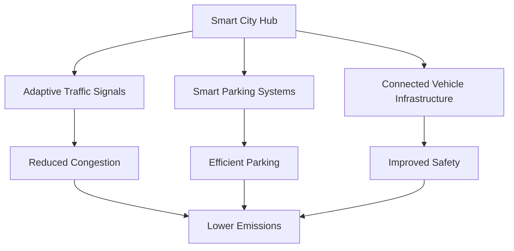

As our cities grow and evolve, so too must our methods of transportation. The future of urban mobility lies in sustainable, efficient, and accessible solutions that can accommodate the needs of a growing population while minimizing environmental impact. In this post, we'll explore some of the most promising innovations in sustainable urban transportation and the challenges we face in implementing them.

## Electric Vehicles: Beyond Personal Cars

While electric cars have gained significant traction in recent years, the future of urban transportation extends far beyond personal vehicles. We're seeing exciting developments in:

- **Electric Buses**: Cities like Shenzhen, China, have already converted their entire bus fleet to electric vehicles, significantly reducing emissions and noise pollution.
- **E-Trucks for Last-Mile Delivery**: Companies are investing in electric delivery vehicles to make urban logistics more sustainable.
- **Electric Taxis and Ride-Sharing**: Services like Uber and Lyft are encouraging drivers to switch to electric vehicles, with some cities mandating the transition.

> "The shift to electric vehicles is not just about personal cars. It's a complete reimagining of how we move people and goods in urban environments." - Dr. Emma Rodriguez, Urban Planning Expert

## Micro-mobility Solutions

Micro-mobility refers to small, lightweight vehicles operating at speeds typically below 25 km/h. These solutions are gaining popularity for their efficiency in navigating congested urban areas:

1. **E-Scooters**: Rentable electric scooters have taken cities by storm, offering a quick and easy way to cover short distances.
2. **Bike-Sharing Programs**: Both traditional and electric bike-sharing schemes provide flexible, eco-friendly transportation options.
3. **Personal Electric Vehicles (PEVs)**: From electric skateboards to one-wheeled devices, PEVs are diversifying urban mobility options.

| Vehicle Type | Average Speed | Max Range | Eco-Friendliness (1-10) |
|--------------|---------------|-----------|-------------------------|
| E-Scooter    | 15 km/h       | 20-30 km  | 8                       |
| E-Bike       | 20 km/h       | 40-100 km | 9                       |
| PEV          | 10-25 km/h    | 15-40 km  | 8                       |

## Smart Infrastructure

The backbone of future urban transportation will be smart infrastructure that can adapt to real-time conditions and support various modes of transport:

- **Adaptive Traffic Signals**: AI-powered traffic lights that adjust to traffic flow, reducing congestion and emissions from idling vehicles.
- **Smart Parking Systems**: Sensors and apps guiding drivers directly to available parking spots, reducing time spent searching.
- **Connected Vehicle Technology**: Infrastructure that communicates with vehicles to improve safety and efficiency.

## Public Transportation Reimagined

Public transit remains a crucial component of sustainable urban mobility. Future innovations include:

- **Autonomous Shuttles**: Self-driving buses and shuttles operating on fixed or flexible routes.
- **Hyperloop and High-Speed Rail**: For inter-city travel, these technologies promise to reduce reliance on short-haul flights.
- **Mobility-as-a-Service (MaaS)**: Integrated platforms allowing users to plan and pay for various modes of transportation seamlessly.

### Case Study: MaaS in Helsinki

Helsinki's Whim app is a pioneering example of MaaS in action. Users can access and pay for various transportation options through a single interface, making car-free living more convenient than ever.

## Challenges and Considerations

While the future of urban transportation looks promising, several challenges need to be addressed:

1. **Infrastructure Costs**: Upgrading city infrastructure to support new transportation modes can be expensive.
2. **Equity and Accessibility**: Ensuring that new transportation solutions are available and affordable for all residents.
3. **Privacy Concerns**: As transportation becomes more connected, protecting user data becomes crucial.
4. **Regulatory Hurdles**: Many new technologies operate in legal gray areas that need to be addressed.
5. **Cultural Shift**: Encouraging people to move away from personal car ownership towards shared and public transportation options.

## The Road Ahead

The future of sustainable urban transportation is not about a single solution, but rather an ecosystem of interconnected, efficient, and environmentally friendly options. As we move forward, collaboration between city planners, technology companies, policymakers, and citizens will be crucial in creating transportation systems that are not only sustainable but also inclusive and adaptable to the unique needs of each urban environment.
